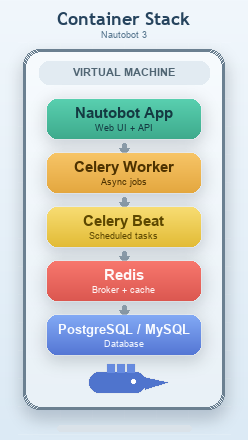

# nautobot-docker-compose

Network to Code has an existing published Nautobot Docker Image on Docker Hub. See [here](https://hub.docker.com/repository/docker/networktocode/nautobot). This project uses Docker Compose. The Docker compose file in this project pulls that Nautobot Docker image using the latest stable Nautobot release along with several other Docker images required for Nautobot to function.  See the diagram below.  This project is for those looking for a multi-container single-node install for Nautobot often coupled with backup & HA capabilities from their hypervisor manager. 



By default, this project deploys the Nautobot application, a single worker container, Redis containers, and PostgresQL.  It does not deploy NGINX, SSL, or any Nautobot plugins, . However, the project is extensible to allow users to tailor to their specific requirements.  For example, if you need to deploy [SSL](docs/create_ssl_cert.md) or [plugins](docs/plugins.md), see the docs linked. The web server used on the application is [pyuwsgi](https://uwsgi-docs.readthedocs.io/en/latest/).

## Environment Variable Controls

There are two variables that should be set for the Docker-Compose file. The following table covers the environment variables, default setting, and what it does.

| Environment Variable | Default | Notes |
| -------------------- | ------- | ----- |
| PYTHON_VER | 3.9 | This sets the Python version within the container version. 3.6 - 3.9 are initially supported |
| NAUTOBOT_IMAGE | 1.2.8 | The version of Nautobot to use in the container image |
## NOTE - Celery Worker

This docker-compose includes the Celery worker that was introduced with Nautobot 1.1.0. Please comment out or remove the celery worker in the `docker-compose.yml` if you are using a pre-1.1.0 release.

## NOTE - MySQL

If you want to use MySQL for the database instead of postgres, In step 7 below instead use
```
docker-compose -f docker-compose.yml -f docker-compose.mysql.yml up
```

## Docker Compose

The provided Docker Compose makes use of environment variables to control what is to be used. This is tightly coupled with the Docker image that is provided on Docker Hub.

## Getting Started - Plugins

The installation of plugins has a slightly more involved getting started process. See see the [Plugin documentation.](docs/plugins.md).

## Getting Started

1. Have [Docker](https://docs.docker.com/get-docker/) and [Docker Compose](https://docs.docker.com/compose/install/) installed on the host
2. Clone this repository to your Nautobot host into the current user directory.
```
git clone https://github.com/nautobot/nautobot-docker-compose.git
```

3. Navigate to the new directory from the git clone

```
cd nautobot-docker-compose
```

4. Copy `local.env.example` to `local.env`
```
cp local.env.example local.env
```

5. Update the `.env` file for your environment. **THESE SHOULD BE CHANGED** for proper security!
```
vi local.env
```

6. Update the `.env` to be only available for the current user
```
chmod 0600 local.env
```

7. Run `docker-compose up` to start the environment
```
docker-compose up
```

## Super User Account

### Create Super User via Environment

The Docker container has a Docker entrypoint script that allows you to create a super user by the usage of Environment variables. This can be done by updating the example `.env` file environment option of `NAUTOBOT_CREATE_SUPERUSER` to `True`. This will then use the information supplied to create the super user.

### Create Super User via Container

After the containers have started:

1. Verify the containers are running:
```
docker container ls
```
Example Output:
```
❯ docker container ls                                                   
CONTAINER ID   IMAGE                           COMMAND                  CREATED         STATUS                   PORTS                                                                                  NAMES
143f10daa229   networktocode/nautobot:latest   "nautobot-server rqw…"   2 minutes ago   Up 2 minutes (healthy)                                                                                          nautobot-docker-compose_nautobot-worker_1
bb29124d7acb   networktocode/nautobot:latest   "/docker-entrypoint.…"   2 minutes ago   Up 2 minutes (healthy)   0.0.0.0:8080->8080/tcp, :::8080->8080/tcp, 0.0.0.0:8443->8443/tcp, :::8443->8443/tcp   nautobot-docker-compose_nautobot_1
ad57ac1749b3   redis:alpine                    "docker-entrypoint.s…"   2 minutes ago   Up 2 minutes             6379/tcp                                                                               nautobot-docker-compose_redis-queue_1
5ab83264e6fe   postgres:10                     "docker-entrypoint.s…"   2 minutes ago   Up 2 minutes             5432/tcp                                                                               nautobot-docker-compose_postgres_1
a9ec61ce5e30   redis:alpine                    "docker-entrypoint.s…"   2 minutes ago   Up 2 minutes             6379/tcp                                                                               nautobot-docker-compose_redis-cacheops_1
a84a89169300   76e40881ecc6                    "docker-entrypoint.s…"   5 weeks ago     Up 5 hours               5432/tcp                                                                               nautobot_plugin_chatops_ansible_postgres_1
60ef800be813   redis:5-alpine                  "docker-entrypoint.s…"   5 weeks ago     Up 5 hours               6379/tcp                                                                               nautobot_plugin_chatops_ansible_redis_1
```

2. Enter the bash shell for the `nautobot-docker-compose_nautobot_1` container as indicated by the name in the last column for the Nautobot container that has ports listed
```
docker exec -it nautobot-docker-compose_nautobot_1 bash
```

3. Execute Create Super User Command and follow the prompts
```
nautobot-server createsuperuser
```
Example Prompts:
```
nautobot@bb29124d7acb:~$ nautobot-server createsuperuser
Username: administrator
Email address: 
Password: 
Password (again): 
Superuser created successfully.
```

